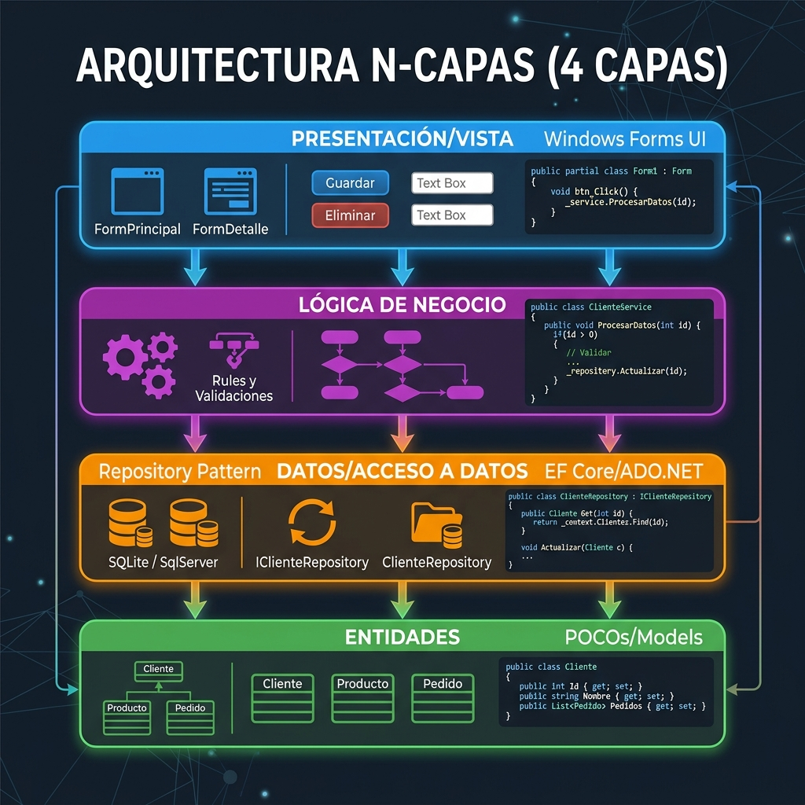
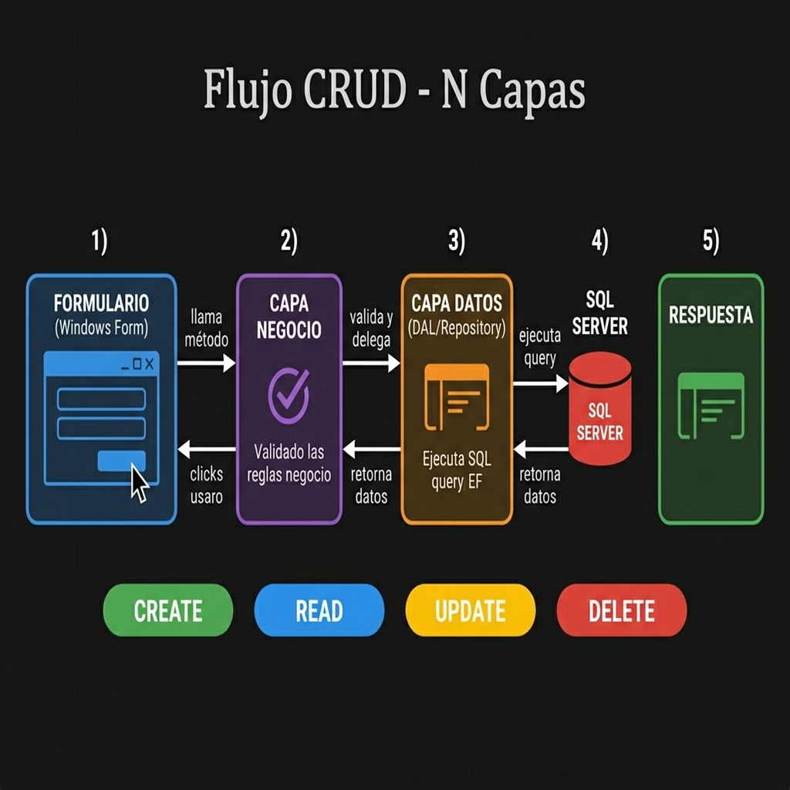
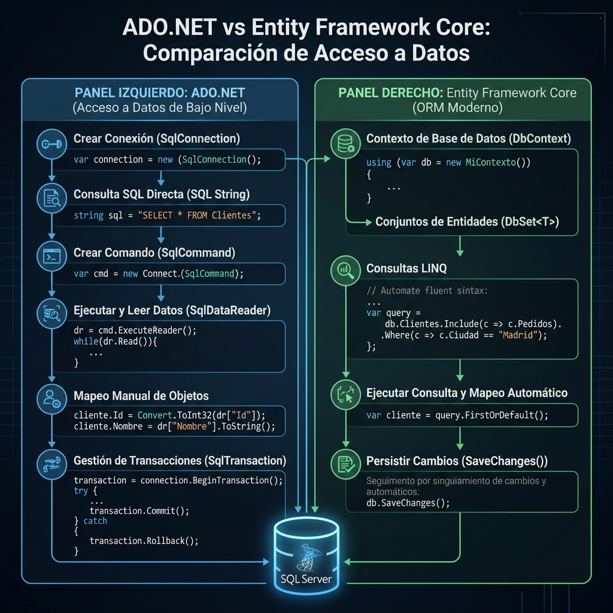
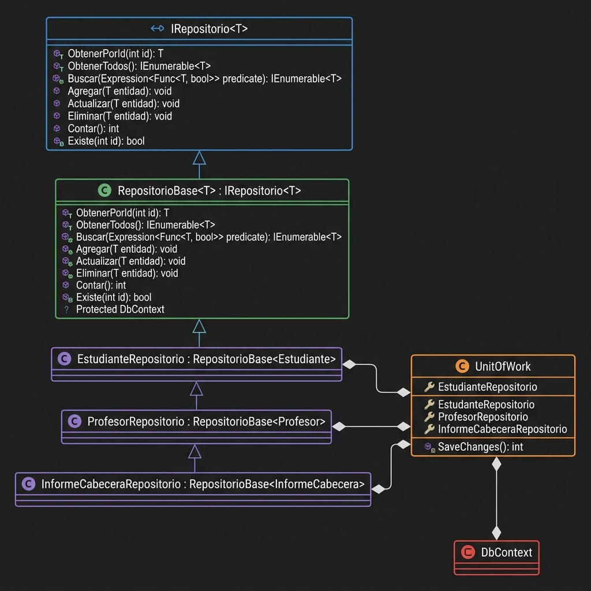
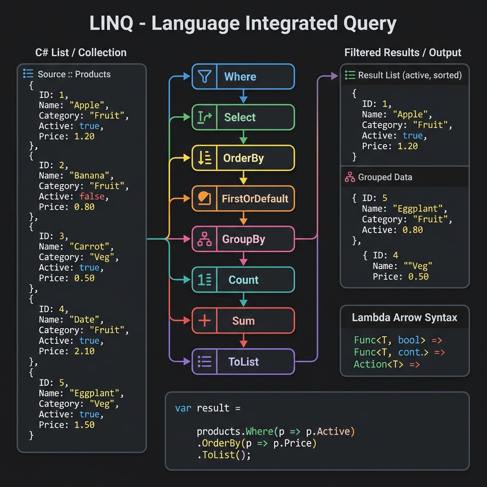
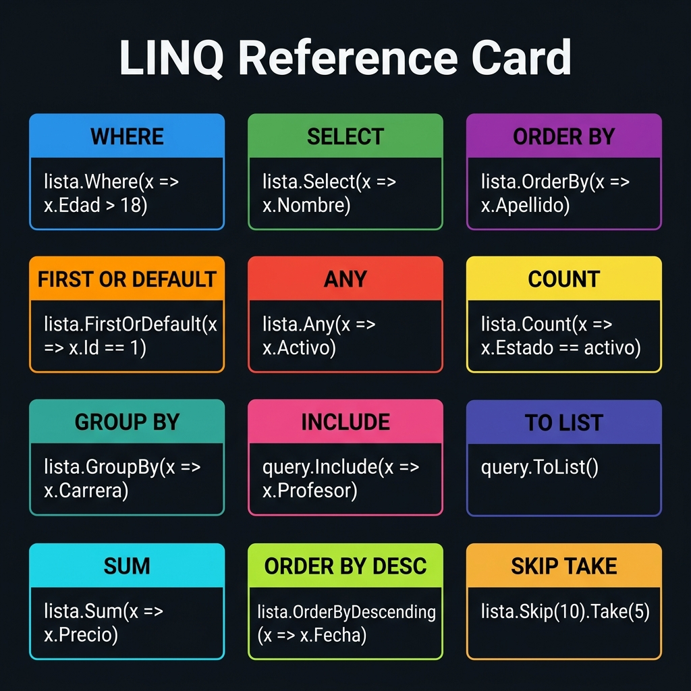
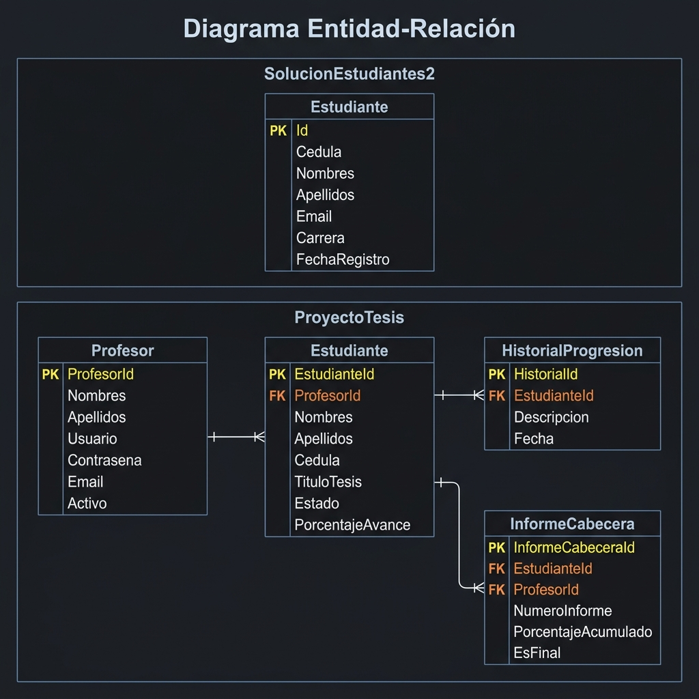

# 🚀 Masterclass de C# .NET: Arquitectura N-Capas, LINQ y Patrones de Diseño

> **Guía de Estudio Definitiva para el Examen de Programación Avanzada**
> *Documentación superdetallada paso a paso de los proyectos del semestre.*

Bienvenidos a la documentación más completa jamás creada sobre el desarrollo de software empresarial en C#. Este README no solo documenta el código, sino que **enseña cómo pensar y estructurar** aplicaciones modernas.

Todo el contenido está basado en los proyectos reales desarrollados durante el semestre (disponibles en este mismo directorio), enfocándose exclusivamente en **Arquitectura de 4 Capas** y manipulación avanzada de datos con **LINQ**.

---

## 📑 Índice de Contenidos

1. [Arquitectura N-Capas (4 Capas)](#1-arquitectura-n-capas-4-capas)
2. [El Flujo de Vida de un Dato (CRUD)](#2-el-flujo-de-vida-de-un-dato-crud)
3. [Acceso a Datos: ADO.NET vs Entity Framework](#3-acceso-a-datos-adonet-vs-entity-framework)
4. [Patrones Avanzados: Repository y Unit of Work](#4-patrones-avanzados-repository-y-unit-of-work)
5. [Mastering LINQ (Language Integrated Query)](#5-mastering-linq-language-integrated-query)
6. [Diseño de Base de Datos (Modelo Entidad-Relación)](#6-diseño-de-base-de-datos-modelo-entidad-relación)
7. [Directorio de Proyectos](#7-directorio-de-proyectos)

---

## 1. Arquitectura N-Capas (4 Capas)

El objetivo principal de la arquitectura N-Capas es la **Separación de Responsabilidades (Separation of Concerns)**. Un proyecto que mezcla la interfaz gráfica con las consultas SQL es imposible de mantener. Por eso, dividimos el sistema en componentes aislados.



### Las 4 Capas Fundamentales:

1. 💻 **Presentación / Vista (UI):** 
   - **Qué hace:** Interactúa con el usuario. Muestra formularios, botones, tablas (DataGrid).
   - **Regla de oro:** ¡No contiene NUNCA código de base de datos ni validaciones de negocio complejas! Solo captura eventos y llama a la capa de Negocio.
2. ⚙️ **Lógica de Negocio (BLL - Business Logic Layer):**
   - **Qué hace:** Es el "Cerebro" de la aplicación. Valida reglas (ej: *Un estudiante debe tener cédula válida*, *El porcentaje de avance no puede pasar 100%*).
   - **Regla de oro:** Si la validación pasa, llama a la Capa de Datos. Si falla, devuelve un error a la Presentación.
3. 🗄️ **Acceso a Datos (DAL - Data Access Layer):**
   - **Qué hace:** Es la única capa autorizada para hablar con SQL Server. Ejecuta los `SELECT`, `INSERT`, `UPDATE`, `DELETE`.
   - **Regla de oro:** No le importa de dónde vienen los datos ni para qué se usan, solo los guarda o recupera.
4. 📦 **Entidades (Modelos / POCOs):**
   - **Qué hace:** Define la estructura de los datos. Son simples clases de C# con propiedades (`get; set;`).
   - **Regla de oro:** Esta capa es compartida por TODAS las demás capas. Es el "idioma común" con el que se comunican.

---

## 2. El Flujo de Vida de un Dato (CRUD)

¿Qué pasa exactamente cuando un usuario hace clic en el botón "Guardar"? El dato viaja a través de todas las capas.



### Anatomía de un Flujo Completo (Ejemplo: Guardar Estudiante)

**Paso 1: La Vista (Formulario)** captura los textos y arma la Entidad.
```csharp
// Dentro del evento btnGuardar_Click en el Formulario
Estudiante nuevo = new Estudiante();
nuevo.Cedula = txtCedula.Text;
nuevo.Nombres = txtNombres.Text;

// La Vista le pasa la pelota a la Capa de Negocio
Respuesta r = EstudianteNEG.Insertar(nuevo);
MessageBox.Show(r.Mensaje);
```

**Paso 2: La Lógica de Negocio (`EstudianteNEG.cs`)** recibe el objeto y lo interroga.
```csharp
public static Respuesta Insertar(Estudiante e)
{
    // 1. Validar reglas del negocio
    if (e.Cedula.Length != 10) return Respuesta.Error("Cédula inválida");
    
    // 2. Si todo está bien, delegar a la capa de Datos
    bool exito = EstudianteDAL.Insertar(e);
    
    // 3. Empaquetar la respuesta
    return exito ? Respuesta.Ok("Guardado") : Respuesta.Error("Falló DB");
}
```

**Paso 3: El Acceso a Datos (`EstudianteDAL.cs`)** abre la conexión y ejecuta SQL.
```csharp
public static bool Insertar(Estudiante e)
{
    // Conecta con SQL Server
    using(SqlConnection cx = new SqlConnection(cadena))
    {
        SqlCommand cmd = new SqlCommand("INSERT INTO Estudiantes (Cedula) VALUES (@c)", cx);
        cmd.Parameters.AddWithValue("@c", e.Cedula);
        cx.Open();
        return cmd.ExecuteNonQuery() > 0;
    }
}
```

---

## 3. Acceso a Datos: ADO.NET vs Entity Framework

Durante el semestre utilizamos dos enfoques diferentes para la Capa de Datos.



### Enfoque 1: ADO.NET Puro (Proyecto: `SolucionEstudiantes2`)
Es el método clásico y manual. Te da el control absoluto sobre el SQL.
- 🔧 **Herramientas:** `SqlConnection`, `SqlCommand`, `SqlDataReader`.
- ⚠️ **Riesgos:** Debes mapear cada columna manualmente.

### Enfoque 2: Entity Framework / ORM (Proyecto: `ProyectoTesis_4Capas`)
Un ORM (Object-Relational Mapper) convierte automáticamente tus clases C# en tablas.
- 🔧 **Herramientas:** `DbContext`, `DbSet<T>`.
- ⚡ **Ventaja:** Te olvidas de escribir cadenas de texto con SQL. Consultas usando LINQ.

---

## 4. Patrones Avanzados: Repository y Unit of Work



### El Patrón Repositorio (Repository Pattern)
Crea una abstracción entre el código de negocio y Entity Framework.

### El Patrón Unit of Work
Asegura que múltiples repositorios compartan la misma conexión a la base de datos y que las transacciones sean atómicas.

---

## 5. Mastering LINQ (Language Integrated Query)

LINQ es la característica más poderosa de C#. Permite tratar colecciones de datos como si fueran tablas SQL.




---

## 6. Diseño de Base de Datos (Modelo Entidad-Relación)



---

## 7. Directorio de Proyectos

Esta carpeta contiene la colección definitiva de los desarrollos clave del semestre.

| Proyecto | Descripción Principal | Tecnologías Destacadas |
|----------|----------------------|-----------------------|
| 📂 **`ProyectoTesis_4Capas`** | Sistema de gestión de tesis universitarias. | **EF Core, Repositories, Unit of Work**, 4 Capas, LINQ avanzado, UI compleja. |
| 📂 **`SolucionEstudiantes2`** | CRUD completo de estudiantes desde cero. | **ADO.NET puro**, 4 Capas estáticas, Transacciones SQL manuales. |
| 📂 **`SistemaVentas`** | Punto de venta y facturación. | 4 Capas, LINQ. |
| 📂 **`SolucionBiblioteca`** | Gestión de préstamos y libros. | 4 Capas, LINQ. |
| 📂 **`TaxiFarePredictor`** | Predicción de tarifas (IA). | **ML.NET**, EF Core, SQL Server, async/await. |
| 📂 **`FarmaciaPresentacion`** | Gestión médica. | LINQ, **Impresión Tickets, QR, Código de Barras.** |

---

# 📚 ANEXO DE ESTUDIO INTENSIVO: CÓDIGO FUENTE LÍNEA POR LÍNEA

> **NOTA PARA EL ESTUDIANTE:** 
> A continuación se presenta el código fuente completo de los componentes más críticos. Todo el código que necesitas para el examen está aquí mismo.

